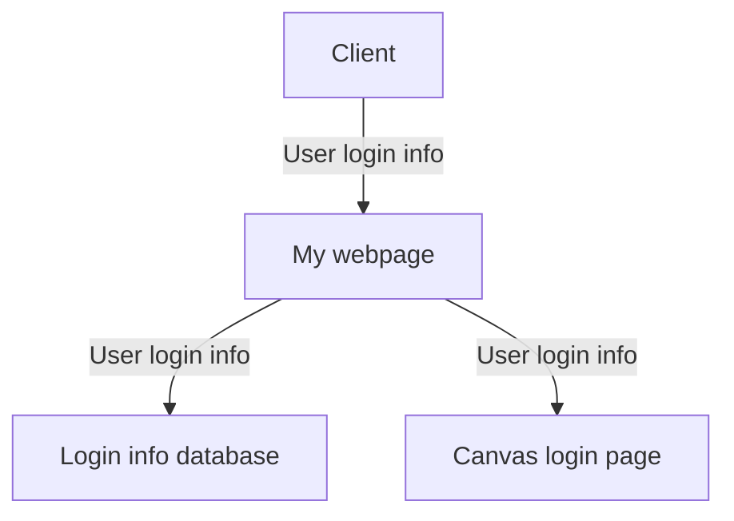
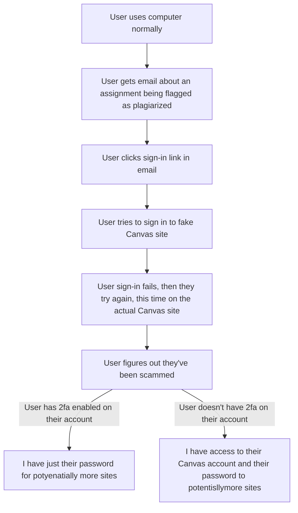

# Phishing project
## 1: Who is our target organization?
Instructure

## 2: What is our target's mission? What are they trying to do or what are they already doing?
Provide a platform for educators to give students assignments

## 3: Identify the asset you will be attempting to steal or compromise in your attack.
Login information (Mainly the password)

### 3a: Describe how your attack will work. Identify the group you will be targeting.
I will be attempting to trick gullible students who aren't as tech-aware.

### 3b: Provide a data flow daiagram that shows the pathway between the users you intend to attack and the asset you are trying to steal.
        User             User
        login            login
        info             info
          │                │
┌──────┐  ▼  ┌──────────┐  ▼  ┌─────────────────┐
│Client├────►│My website├────►│Canvas login page│
└──────┘     └────┬─────┘     └─────────────────┘
                  │
                  │
             ┌────▼─────┐
             │Login info│
             │database  │
             └──────────┘

### 3c: Provide a user workflow diagram that describes the workflow of the users you are attacking. I should be clear where the phishing attack occurs in this workflow.
┌─────────────┐     ┌──────────────────┐     ┌───────────────────┐
│User is using│     │User gets e-mail  ├────►│User clicks sign-in│
│computer     ├────►│about having an   │     │link in email      │
│normally     │     │assignment flagged│     └────────┬──────────┘
└─────────────┘     │as plagiarized    │              │
                    │and that they need│              ▼
                    │to sign in to     │     ┌──────────────────┐
                    │Canvas.           │     │User tries to sign│
                    └──────────────────┘     │in to fake Canvas │
                                             │site              │
                                             └────────┬─────────┘
                                                      │
                                                      ▼
                      ┌────────────────┐     ┌────────────────────┐
                      │User figures out│     │User sign-in fails, │
                      │that they've    │◄────┤they try again, this│
                      │been scammed    │     │time on the actual  │
                      └────────────────┘     │site                │
                                             └────────────────────┘

### 3d: A compelling argument that (a) the phishing attack has a real chance of working and that (b) it can allow you to access your target asset.
(a) For most schools, a student being accused of plagiarism ends up in disciplinary action of some sort
(b) The user is going to want to sign in to their account without thinking too much because they would be freaking out about the trouble they might get in due to being accused of plagiarism

### You may find it useful to create an attack tree, but this isn't required.

## 4: Analysis of the defenses the organization will likely have in place. In this section, you should also list how you intend to overcome/cicumvent these defenses.
2fa: I won't need it, because I'm not targeting the canvas site, as they can have OIT reset their password and/or lock their account.
For other schools, they might not have an IT department that can help that quickly/at all, so without 2fa on their account, I will have access to their Canvas account.
Mainly, I want the password since people usually tend to use the same password in multiple places.